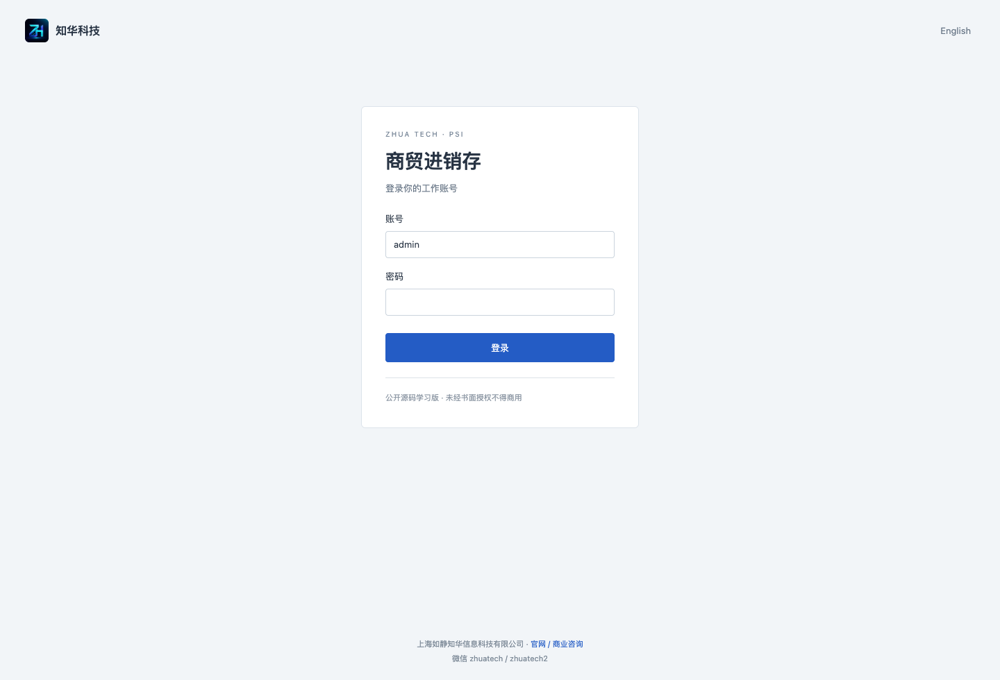
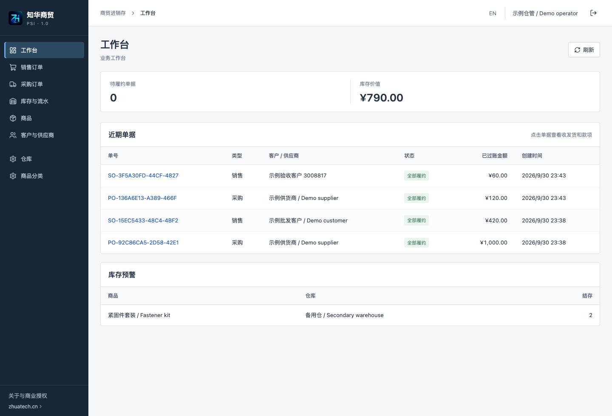
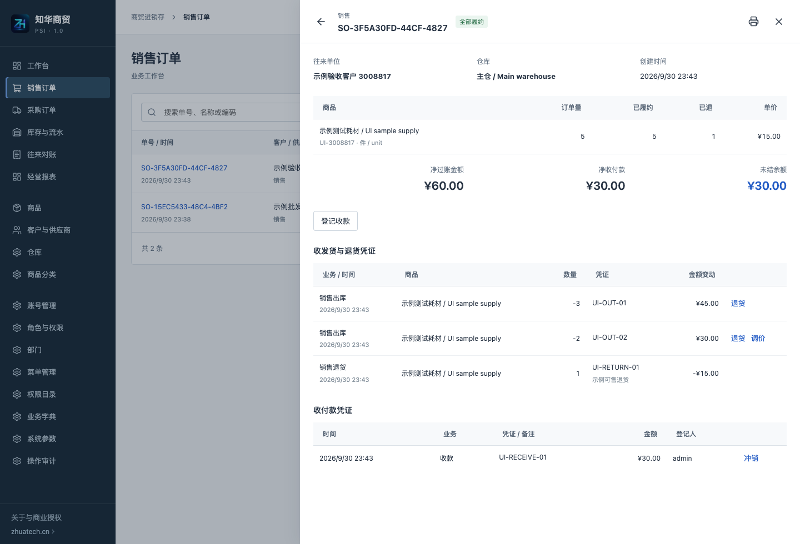
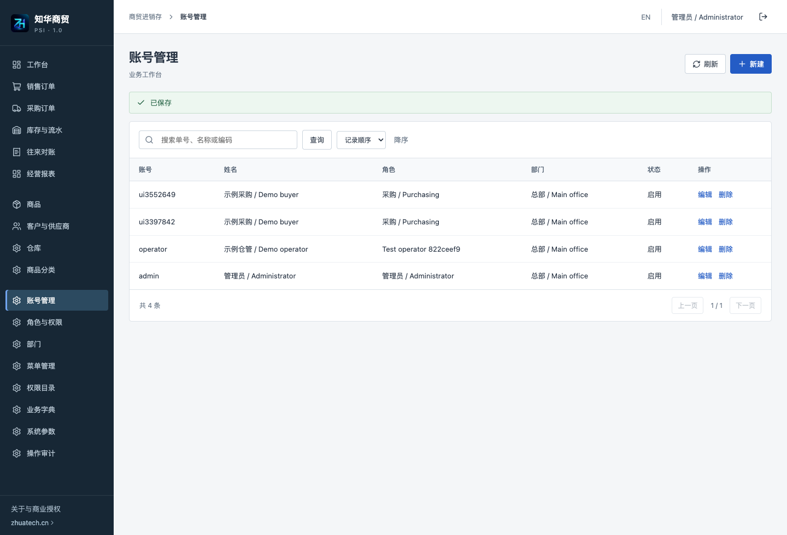
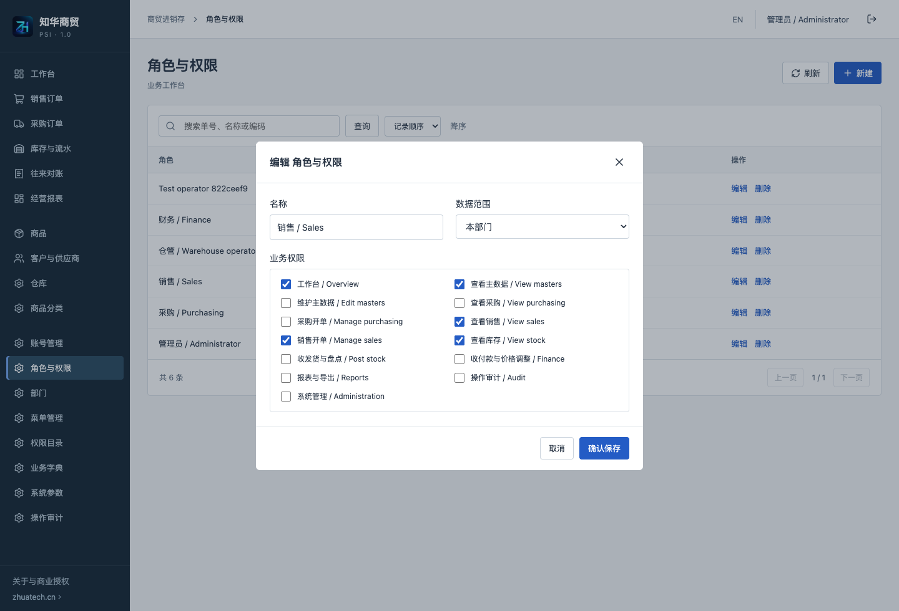
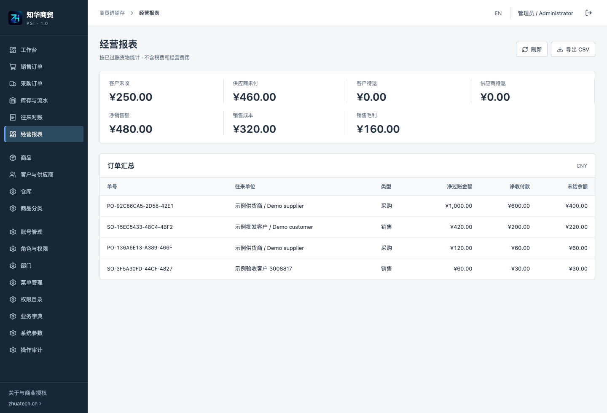
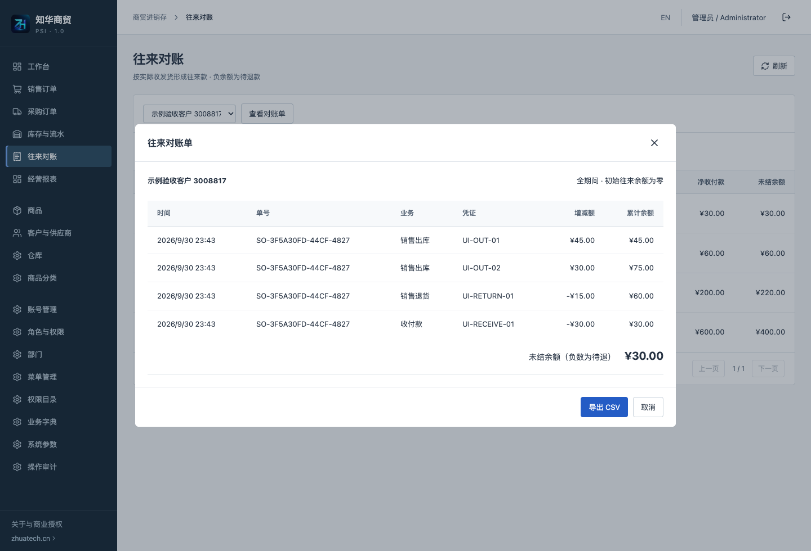

<p></p>

# 知华科技商贸进销存 · ZhuaTech PSI

**公开源码学习版 · Non-commercial source edition**

把一笔采购、分批入库、销售发货、原单退货和实际收付款放在同一套可核对的台账里。适用于五金、办公耗材等非食品实物商品的小型批发业务的学习评估，也供实施团队审查完整的前后端源码。商业授权、企业交付、收费部署及商业二次开发须取得书面授权。

知华科技（上海如静知华信息科技有限公司） · [官网](https://www.zhuatech.cn/) · 微信 `zhuatech` / `zhuatech2`。

English documentation: [Trade & inventory guide](docs/ENGLISH.md). Chinese and English interfaces are included.

## 货与款如何衔接

开单员建立采购或销售草稿，选择同部门的往来单位、仓库和商品。确认订单后明细冻结，仓管按实际数量分批登记入库或出库，每次留下凭证号。财务再核对银行、现金等实际凭据，登记付款或收款。订单确认本身不会生成库存或应收应付。

退货必须引用原收发货凭证，累计数量不能超过该次履约数量。可售销售退货按原出库成本回补库存；采购退货按当时移动平均成本出库，往来款按原入库金额冲减。已足额收款后的退货形成待退余额，实际退款另行登记。只调价时不增加库存；款项录错以新增冲销记录纠正，原凭证保留。

采购、库存、财务状态分别展示：单据的“全部履约”仅表示数量全部收发，不代表货款已结清。页面、打印、对账单和 CSV 采用相同过账口径。

## 已实现的业务与管理

| 业务能力 | 操作与约束 |
| --- | --- |
| 商品、分类、条码、基本单位、参考价格 | 新增、修改、删除、启停；扫码或输入条码开单；引用保护；部门与基本单位不可直接改写 |
| 客户、供应商与仓库 | 部门归属、检索、启停、引用保护；往来单位类型不能直接转换 |
| 采购与销售 | 草稿编辑删除、确认、作废、分批履约、原单退货；确认后冻结商品、数量和价格 |
| 库存与成本 | 仓库商品结存、不可修改流水、移动平均计价、期初入库、带账面快照检查的盘点、同部门调拨、库存预警 |
| 收付款与对账 | 人工付款、收款、退款、原款项冲销；按原履约凭证做价格贷记；逐笔客户/供应商对账和 CSV 导出 |
| 经营查询 | 净过账销售额、销售成本、销售毛利、应收应付和待退余额；列表搜索、筛选、排序、分页、订单打印 |
| 管理端 | 账号、密码重置、角色、权限分配、部门范围、内建菜单配置、字典、系统参数、操作审计 |
| 导入与部署 | 商品 JSON 模板与原子批量导入；Flyway 空库迁移、Compose、健康检查、数据库备份恢复 |

权限代码和页面路径在接口中定义，管理员可以配置现有权限、导航名称、启停及排序，不能新建无业务实现的页面或权限。初始化提供采购、销售、仓管、财务岗位角色；各账号使用独立密码，不共享管理员账号。

**范围边界**：单公司、单记账币种、商品基本单位、无税费运费的货款台账。期初往来余额为零；仅支持商品期初库存，不提供旧应收应付余额导入。采购退货的原采购金额与移动平均出库成本可能不同，库存价值差额保留在流水中；不提供总账分录。销售毛利不包含经营费用、税费、采购退货价差或盘点损益，不能当税务利润。

**未实现**：单位换算、批次/序列号/保质期、多法人/多租户 SaaS、生产加工、损坏品退货入检验仓、跨部门调拨、预收预付、跨单核销、税务发票、在线支付、客户订货商城、平台电商接入。无付费模型或第三方支付配置依赖。确认订单不预占库存，实际出库时再次检查可用量。

该版本将库存、单据及管理写操作通过数据库锁串行化，以保护小团队的业务一致性；未做大型负载验收。列表与参考数据最多每类 10,000 条，超过会明确拒绝读取，不返回截断的财务汇总。扩展规模前需改为数据库分页/聚合和更细的库存锁并重新验收。

## 实际运行页面

截图中的档案和凭证均为虚构学习数据。

| 登录 | 业务端工作台 |
| --- | --- |
|  |  |



| 后台账号管理 | 角色与权限 |
| --- | --- |
|  |  |





## 工程与运行环境

后端 Java **21**、Spring Boot **4.0.7**、Spring Security、Spring Data JPA；前端 Vue **3.5.40**、Vite **8.1.5**、Node.js **24.19.0 或以上**；MySQL **8.4**；Flyway；Nginx **1.29**；Docker Compose v2。精确依赖见 Maven 和前端锁文件。

浏览器 → Nginx 同源代理 `/api` → Java 服务 → MySQL。Cookie 会话为 HttpOnly，写请求需要 CSRF；权限与部门范围在后端重新检查，账号禁用或权限撤销即时生效。密码 BCrypt 加密，单进程登录失败限流，会话空闲 30 分钟失效。

```text
backend/     业务、权限、认证、HTTP 接口和单元/集成测试
  src/main/resources/db/migration/   Flyway 版本脚本
frontend/    中英文业务端与管理端、Nginx、原始品牌素材
docs/        操作、部署、架构、英文指南与真实截图
scripts/     发布静态检查与真实 MySQL 冒烟验证
compose.yaml MySQL、后端、前端健康依赖与持久化卷
.env.example 配置字段，不包含真实凭证
LICENSE      自有代码非商业许可
```

数据库 `zhuatech_psi` 保存 19 个业务/管理表及 1 个 Flyway 历史表。`V1__psi_schema.sql` 包含建表、唯一键、外键、数量约束和索引，JPA 只验证结构。初始化器首次空库创建权限、岗位角色、菜单、字典、参数和管理员；重启不覆盖密码和业务数据。详见 [架构与数据说明](docs/ARCHITECTURE.md)。

## 安装与首次登录

```sh
cp .env.example .env
# 填写独立强密码：MYSQL_ROOT_PASSWORD、DATABASE_PASSWORD、ADMIN_PASSWORD。
docker compose up -d --build --wait
```

默认初始化账号 **admin**；初始密码由 **ADMIN_PASSWORD** 提供，12–72 位，含大小写字母及数字。不存在通用默认密码。已有数据库不会因修改环境变量重置管理员，请通过账号管理或修改密码操作。

前端 `http://127.0.0.1:8096/`；健康检查 `http://127.0.0.1:8096/actuator/health`。数据库和后端没有宿主机公开端口。端口冲突在 `.env` 设置 `WEB_PORT`，不得停止其他系统。

`SEED_DEMO=true` 在首次空库加入虚构商品、客户供应商和两个仓库，不伪造收发货或付款。管理员创建业务账号，再分别使用采购、仓管、销售和财务账号操作。

| 环境变量 | 用途 |
| --- | --- |
| `MYSQL_ROOT_PASSWORD` / `DATABASE_PASSWORD` | 数据库 root 与业务账号独立强密码，必填 |
| `ADMIN_USERNAME` / `ADMIN_PASSWORD` | 空库初始化账号及强密码 |
| `SEED_DEMO` | 是否在空库加入虚构主数据，默认 false |
| `WEB_PORT` / `BIND_ADDRESS` | 默认 8096 / 127.0.0.1，仅本机监听 |
| `COOKIE_SECURE` | HTTPS 部署设为 true；本地 HTTP 为 false |
| `DATABASE_URL` / `DATABASE_USER` | 外部数据库或本地直接运行时使用 |

系统参数维护公司名称、显示时区、币种。记账币种须有两位小数，第一次订单或库存流水后不能改成其他币种；参考价格改变不会自动换汇。

本地开发需要 Java 21、Maven、Node.js 和独立 MySQL。配置数据库和管理员环境变量后分别执行：

```sh
cd backend
mvn spring-boot:run
# 另开终端
cd frontend
npm ci
npm run dev
```

开发前端默认 5173，仅开发代理连接本地 8080。生产静态文件通过 Nginx 服务名代理，不写死 localhost。Docker 构建运行测试，不跳过测试。

## 操作、备份和升级

- [操作手册](docs/OPERATIONS.md)：完整采购销售过程、退货、价格调整、退款和纠错。
- [部署与恢复](docs/DEPLOYMENT.md)：端口、HTTPS、独立备份恢复、数据库连接和升级。
- [架构与接口](docs/ARCHITECTURE.md)：权限、状态、成本、数据表和业务接口。
- [English guide](docs/ENGLISH.md)：deployment and supported business flow.
- [第三方许可](docs/THIRD_PARTY.md)：依赖保留各自版权与许可证。

升级前备份业务数据库和配置，新版本只增加迁移文件，不修改已执行的迁移。Flyway 启动时验证并升级；迁移校验失败先停升级、核对日志和恢复方案，不直接删除历史记录。不要用 `down -v` 清理真实业务卷。

## 质量检查

```sh
cd backend
mvn spotless:check test package
cd ../frontend
npm ci
npm run format:check
npm run lint
npm test
npm run build
cd ..
docker compose config --quiet
python3 scripts/release-check.py
git diff --check
```

测试覆盖数量/金额精度、移动平均尾差、分批履约、退货退款、幂等重试、原子回滚、并发防超卖、认证与部门权限、对账、导出和凭证冲销。自动集成测试使用 H2 MySQL 兼容模式；真实 MySQL 空库、页面操作与恢复检查另外执行。当前验收结果见 [验收记录](docs/VALIDATION.md)。

## 安全与故障处理

`.env`、真实凭证、日志、备份和客户数据均不提交。公网部署必须配置 HTTPS、`COOKIE_SECURE=true` 和可信反向代理；不能共享管理员账号或直接把业务实例当公共演示。公共试用需要隔离数据、独立账号与防滥用措施，此仓库不提供公共演示租户隔离。

数据库使用 MariaDB Connector/J 3.5.10 连接 MySQL 8.4。Compose 内网使用 `sslMode=trust`；外部数据库应使用证书校验模式和可信 CA，不将内网配置照搬到公网。见部署说明。

健康失败检查数据库密码和容器日志；403 检查权限、部门和 CSRF；409 检查单据状态、库存、累计退货、货款余额、盘点快照或档案引用。网络超时先刷新查询台账，使用同一请求标识重试；不要重复登记一次实际收付款。超过列表资源上限返回 `RESOURCE_LIMIT`，需要升级查询实现，不能当成无记录。

## 反馈与授权

欢迎通过仓库 Issues/PR 提交可复现问题或业务说明，移除客户数据、凭证及隐私后再上传。贡献需说明测试和依赖许可。安全漏洞通过官网或咨询微信私下反馈，不公开敏感日志或攻击细节。软件按现状提供，适用性和企业交付范围以书面协议为准。

自有代码使用根目录 [LICENSE](LICENSE)，属于公开源码学习版，不是 OSI 标准开源许可项目。第三方依赖保留各自版权和许可。

## 联系知华科技

本项目由知华科技（上海如静知华信息科技有限公司）提供公开源码学习版本，主要用于个人学习、技术研究与非商业交流。未经书面授权不得商用。企业信息化建设、中小企业数字化转型、中小企业 AI 转型、私有化部署、软件外包、软件项目外包、软件实施、FDE 外包、OPC 技术支持及深度定制开发，请访问知华科技官网 [https://www.zhuatech.cn/](https://www.zhuatech.cn/)，或添加微信 zhuatech、zhuatech2 咨询。

<table><tr><td align="center"><br>微信：zhuatech</td><td align="center"><br>微信：zhuatech2</td></tr></table>
