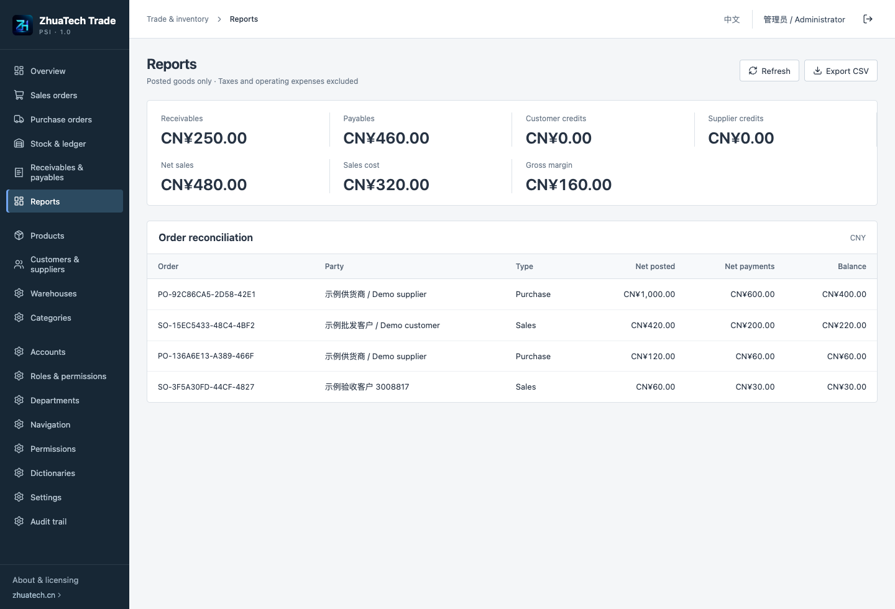
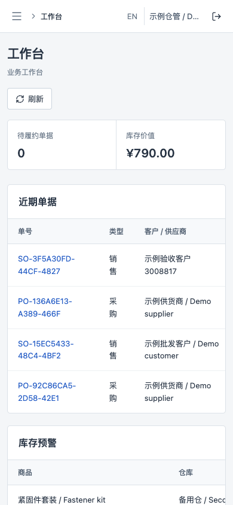

# ZhuaTech Trade & Inventory

Shanghai Rujing Zhihua Information Technology Co., Ltd. · https://www.zhuatech.cn/ · WeChat zhuatech / zhuatech2.

Non-commercial source edition. Personal learning, research and non-commercial exchange are permitted under the root LICENSE. Commercial use, client delivery, paid deployment and commercial modifications require prior written authorization. Third-party components retain their own licenses.

## Business flow

Create products, categories, customers, suppliers and departmental warehouses. Create a purchase order, confirm the frozen lines, post partial receipts, then record verified payments. Create sales orders, post shipments against actual stock and record verified customer payments. Confirmation alone does not change stock or balances.

Return saleable goods against the original shipment/receipt. Returns cannot exceed the original posted quantity. Paid returns create a refundable balance; record an actual refund separately. Price credits reference an original goods entry without adding stock, and must precede physical returns on that entry. Payment mistakes are corrected with linked reversal entries, preserving the original voucher.

Stock uses moving-average valuation by product and warehouse. Sales returns restore original shipment cost; purchase returns remove current average value, which can differ from the original payable credit. Gross margin excludes taxes, operating expenses, stock-count differences and purchase-return valuation differences. This is a goods and payment ledger, not a statutory accounting system.

Opening stock, atomic same-department transfers, stock counts with book-quantity snapshot checking, barcode lookup, JSON product import, order printing and CSV reconciliation are included. Administrative accounts, roles, permissions, departments, navigation, dictionaries, settings and audit are real persisted capabilities.

## Installation

Java21/Spring Boot4.0.7, Vue3.5.40/Vite8.1.5, Node24.19.0+, MySQL8.4, Flyway, Docker Composev2 and Nginx1.29.

```sh
cp .env.example .env
# Set independent MYSQL_ROOT_PASSWORD, DATABASE_PASSWORD and ADMIN_PASSWORD.
docker compose up -d --build --wait
```

Open `http://127.0.0.1:8096/`; health at `/actuator/health`. Initial account `admin`; its strong password is supplied by ADMIN_PASSWORD, never a shared built-in password. Optional SEED_DEMO creates fictional master records on an empty database. WEB_PORT overrides conflicts. Existing data and passwords are not reset on restart.

Use English on the login page or the EN button. Each staff member needs a separate account. Warehouse staff can post goods; finance can record money; both account and department permissions are enforced on the server. Currency has two decimals and is locked after the first order or stock entry. Quantities use one base unit and up to three decimal places.

## Limits and safety

One company, one accounting currency, zero opening receivables/payables. No unit conversion, tax invoicing, online payments, damaged-stock returns, cross-order allocations, batches/expiry, manufacturing, customer web shop or multi-tenant SaaS. Public demo isolation is not included. Writes are serialized through a database mutex for small teams; high-load scaling is unverified. Lists fail explicitly above10,000 records rather than silently truncate balances.

Keep the default localhost bind; use HTTPS and COOKIE_SECURE=true for Internet access. External databases require trusted-CA certificate verification. Never commit environment files, backups, credentials or customer information. Validate backup restoration independently before upgrades; append migrations and do not delete business volumes.

See the Chinese [operation guide](OPERATIONS.md), [deployment guide](DEPLOYMENT.md), [architecture](ARCHITECTURE.md), [validation](VALIDATION.md) and [third-party notices](THIRD_PARTY.md). Contact https://www.zhuatech.cn/ or WeChat zhuatech / zhuatech2 for licensing, integration and delivery enquiries.

## Actual running screens

Fictional evaluation data.




